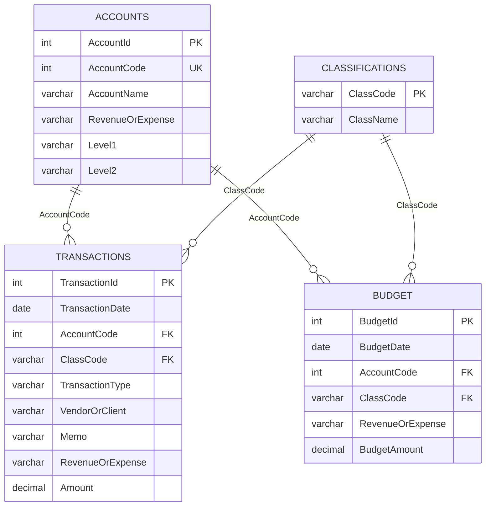

# Entity relationship diagram

```mermaid
erDiagram
    ACCOUNTS ||--o{ TRANSACTIONS : "AccountCode"
    ACCOUNTS ||--o{ BUDGET : "AccountCode"
    CLASSIFICATIONS ||--o{ TRANSACTIONS : "ClassCode"
    CLASSIFICATIONS ||--o{ BUDGET : "ClassCode"

    ACCOUNTS {
        int AccountId PK
        int AccountCode UK
        varchar AccountName
        varchar RevenueOrExpense
        varchar Level1
        varchar Level2
    }

    CLASSIFICATIONS {
        varchar ClassCode PK
        varchar ClassName
    }

    TRANSACTIONS {
        int TransactionId PK
        date TransactionDate
        int AccountCode FK
        varchar ClassCode FK
        varchar TransactionType
        varchar VendorOrClient
        varchar Memo
        varchar RevenueOrExpense
        decimal Amount
    }

    BUDGET {
        int BudgetId PK
        date BudgetDate
        int AccountCode FK
        varchar ClassCode FK
        varchar RevenueOrExpense
        decimal BudgetAmount
    }
```
